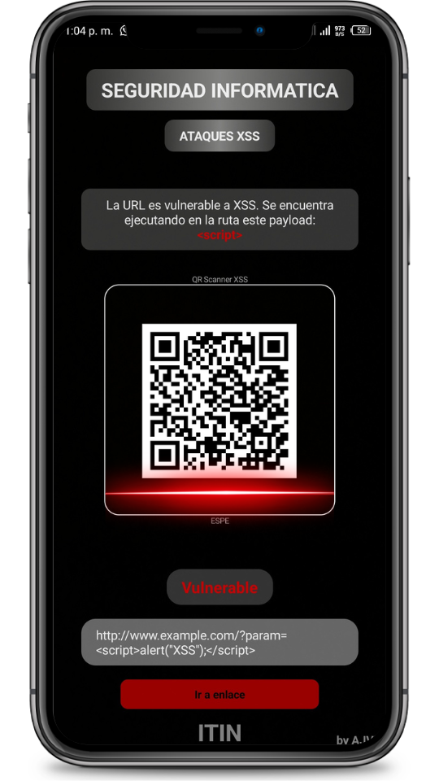
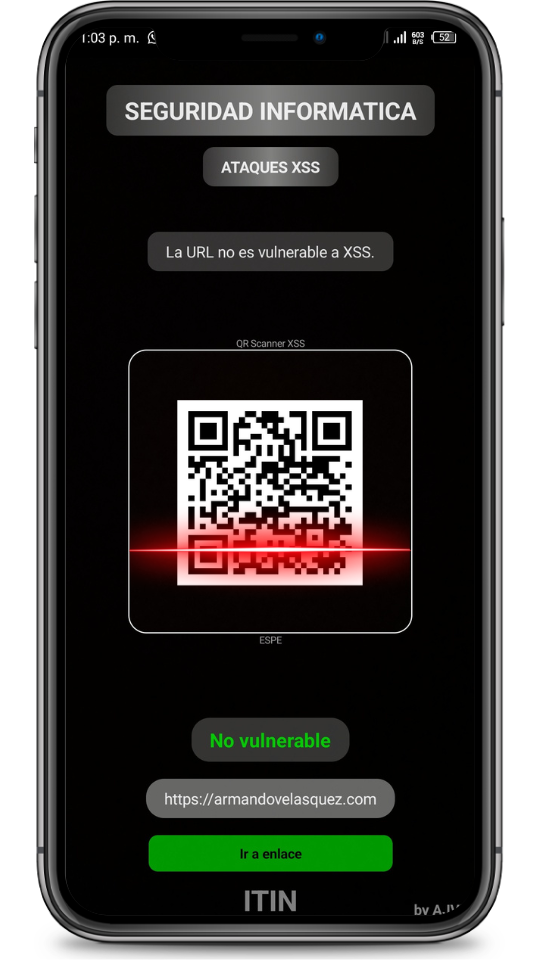
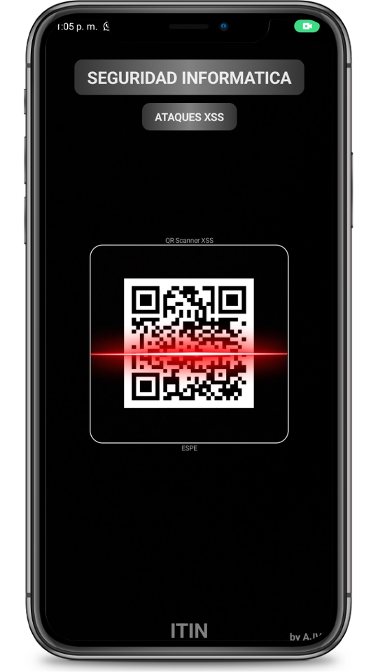

# Aplicación de Escáner QR para Detección de Ataques XSS

## Descripción

La Aplicación de Escáner QR para Detección de Ataques XSS es una herramienta diseñada para proteger a los usuarios de ataques de scripting entre sitios (XSS) al escanear códigos QR y verificar si las rutas especificadas son vulnerables o no. La aplicación está desarrollada en Kotlin y utiliza Jetpack Compose para ofrecer una experiencia de usuario moderna y atractiva.

## Características Principales

- Escaneo de códigos QR para detectar vulnerabilidades XSS.
- Identificación de rutas vulnerables.
- Visualización de mensajes de advertencia en color rojo para rutas vulnerables.
- Visualización de mensajes de éxito en color verde para rutas seguras.
- Botón de redirección a rutas seguras.
- Mensajes informativos para códigos QR que no son rutas.

## Capturas de Pantalla

## Tecnologías Utilizadas

- Lenguaje de Programación: Kotlin.
- Biblioteca de IU: Jetpack Compose.

## Configuración y Ejecución

A continuación, se detallan los pasos para configurar y ejecutar la aplicación:

1. Dirigete a la pagina web de `https://armandovelasquez.com`.
2. En el apartado de Portfolio descargate el apk dando clic en el icono de android de la parte inferior derecha.
3. instala la aplicación dando confiar en fuentes desconocidas.
4. Ejecuta la aplicación en tu dispositivo Android.

## Uso

1. Abre la aplicación en tu dispositivo Android.

2. Escanea un código QR con la cámara de tu dispositivo.

3. La aplicación detectará si la ruta es vulnerable o no.
   - Si es vulnerable, se mostrará un mensaje en color rojo con la ruta vulnerable.
   - Si es segura, se mostrará un mensaje en color verde y un botón para redirigirse a la ruta segura.
   - Si no es una ruta, se mostrará un mensaje informativo.

4. ¡Protégete de los ataques XSS y navega de manera segura!

## Contribuir

Si deseas contribuir a este proyecto, sigue los pasos:

1. Haz un fork del repositorio.

2. Crea una nueva rama para tu contribución: `git checkout -b tu-caracteristica`.

3. Realiza tus cambios y asegúrate de que las pruebas sean exitosas.

4. Envía una solicitud de extracción (Pull Request) con una descripción detallada de tus cambios.

## Licencia

Este proyecto está bajo la licencia [Licencia MIT](LICENSE).

## Créditos

- Desarrollado por `Armando Josue Velasquez Delgado`.
- Base del scanner qr de: `https://github.com/aslansari/jetpack-compose-qr-scanner`.

---

¡Espero que este README te ayude a presentar tu aplicación de escáner QR de manera efectiva! Asegúrate de personalizarlo con detalles específicos de tu proyecto y de incluir capturas de pantalla que muestren la experiencia de usuario.
